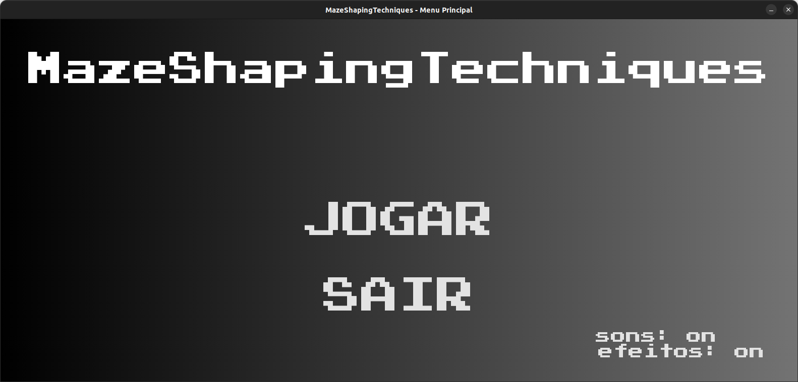
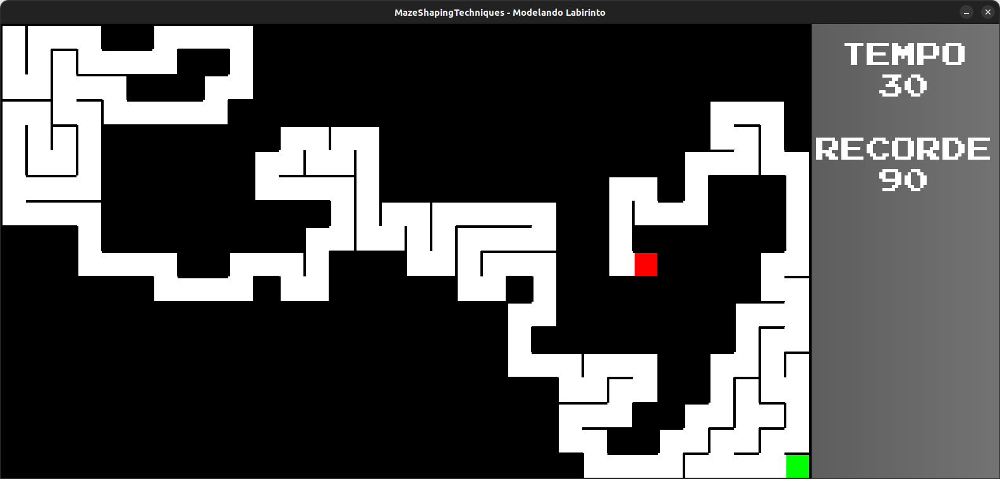
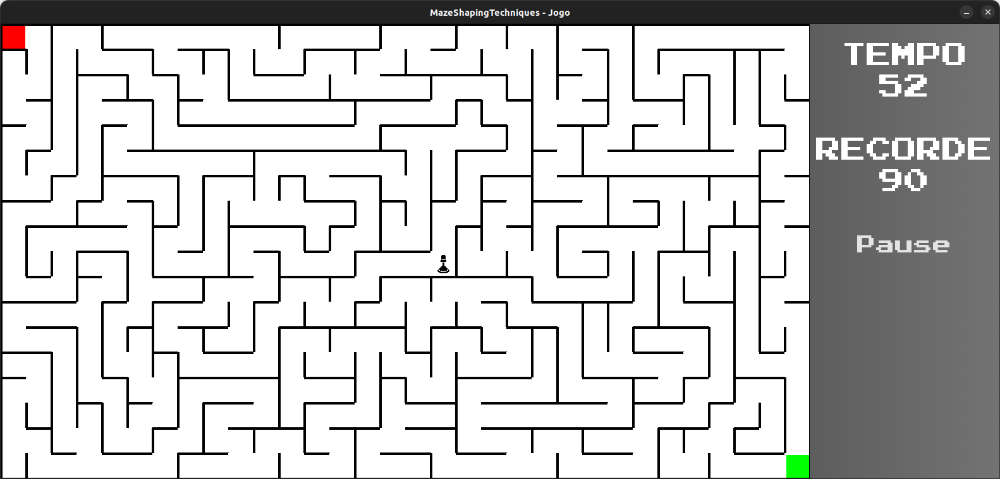

# Grafos2_MST_MazeShapingTechniques

**Conteúdo da Disciplina**: Grafos 2 

## Alunos
|Matrícula | Aluno |
| -- | -- |
| 21/1029620 | Douglas Alves dos Santos |
| 21/1039297 | Bruno Martins Valério Bomfim |

## Sobre 
Este projeto busca implementar um jogo para resolver labirintos gerados aleatoriamente por meio de adpatações de algoritmos de busca em grafos e de produção de MSTs (Minimum Spanning Trees), como a busca em profundidade (DFS) e o algoritmo de Kruskal.

## Screenshots
### Tela inicial

Imagem 1: Tela inicial do jogo (Fonte: autores, 2023).

### Tela de geração do labirinto

Imagem 2: Tela de geração do labirinto (Fonte: autores, 2023).

### Tela de jogo

Imagem 3: Tela de jogo (Fonte: autores, 2023).

### Tela de resultado 

Imagem 4: Tela de resultado (Fonte: autores, 2023).

## Instalação 
**Linguagem**:

Para executar este jogo localmente, certifique-se que você possui o Python (>= 3.10.12) instalado em sua máquina. Caso não possua, você pode baixá-lo [no site oficial](https://www.python.org/downloads/).

É necessário também ter o gerenciador de pacotes pip (>= 22.0.2) instalado. Caso não possua, você pode baixá-lo [aqui](https://pypi.org/project/pip/).

MazeShapingTechniques foi desenvolvido com a biblioteca [pygame](https://www.pygame.org/news). Para instalá-la, execute o seguinte comando no terminal:

    pip install pygame==2.5.2

Em seguida, clone o repositório com o comando

    git clone git@github.com:projeto-de-algoritmos/Grafos2_MST_MazeShapingTechniques.git
## Uso 
Depois de haver instalado as dependências necessárias e clonado o repositório na sua máquina local, a partir da raiz da repositório, navegue até a pasta `src` e execute a `main`

    cd src
    python3 main.py

- Controle os botões com o mouse.
- Tecla `W` move o personagem para cima.
- Tecla `S` move o personagem para baixo.
- Tecla `A` move o personagem para a esquerda.
- Tecla `D` move o personagem para a direita.

## Apresentação
Para a explicação dos principais algoritmos utilizados e da estrutura do projeto, gravamos um vídeo explicativo em formato .mp4, o qual deve ser baixado para ser assistido.

Acesse o vídeo [aqui](assets/apresentacao.mp4)

## Créditos
**Trilha sonora**: *Jesus bleibet meine Freude*, da cantata *Herz und Mund und Tat und Leben (BWV 147)*, de **Johann Sebastian Bach** (1685-1750). Arranjo para versão em [8 bits](https://www.youtube.com/watch?v=KUf-CmUKd1w).

